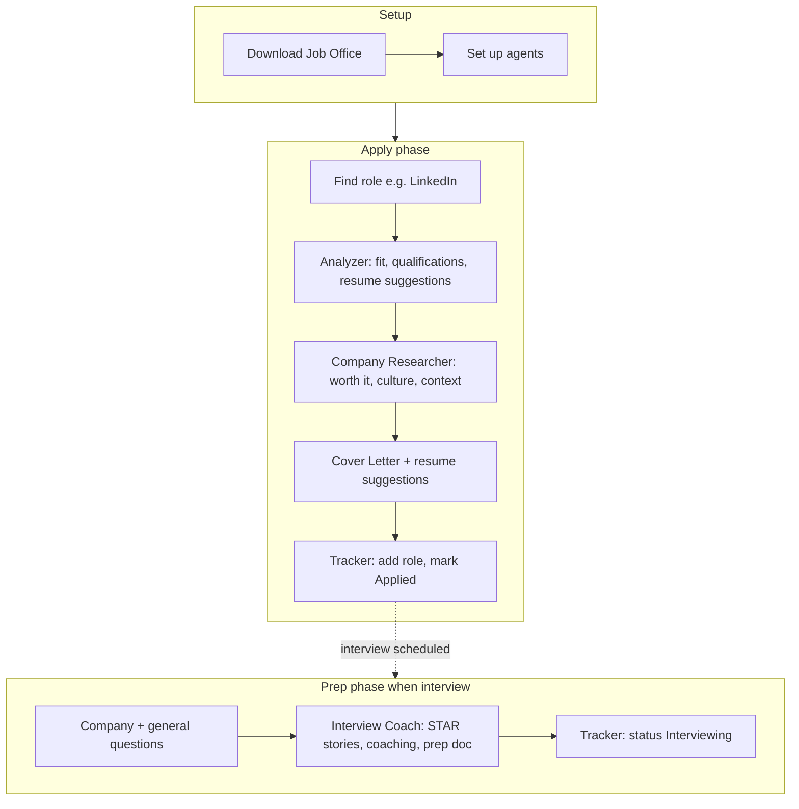

# Recommended Workflow

Set up Shared (resumes, voice, preferences), then follow the workflow below.

---

## Apply phase

1. **Find a role** — e.g. on LinkedIn or elsewhere — that sounds interesting.

2. **Analyzer** — Paste the job description. Get fit score, qualification-by-qualification breakdown, and suggested resume updates. Add the role in **Tracker** when you decide to pursue it (or after the next step).

3. **Company Researcher** — Research the company (funding, culture, growth, verdict: pursue / watch / skip). Do this *before* the cover letter so the letter can reference company context. Tracker shows the research verdict on the pipeline card.

4. **Cover Letter** — Draft the cover letter and get suggested resume edits, using the analysis and company research. Save to Cover-Letter/Output and link from the pipeline.

5. **Tracker** — Mark status **Applied**, link the cover letter, set follow-up date if you want. Tracker is used throughout: add roles after Analyzer, update when you apply, when you get an interview, etc.

---

## Prep phase (when you get an interview)

6. **Questions** — Get company-specific questions (e.g. from Glassdoor) and role-level general questions. An Interview Prep tool is planned to hold these and merge with STAR prep.

7. **Interview Coach / Interview Prep** — Build STAR-format stories (Situation, Task, Action, Result) and a prep doc: likely questions, talking points, gaps to address. (Tool planned.)

8. **Tracker** — Update status to **Interviewing**, add interview date and contacts.

---

## Flow diagram

Tracking is continuous: add the role in Tracker after Analyzer (or when you decide to apply), update to Applied after sending, and to Interviewing when you get an interview.
